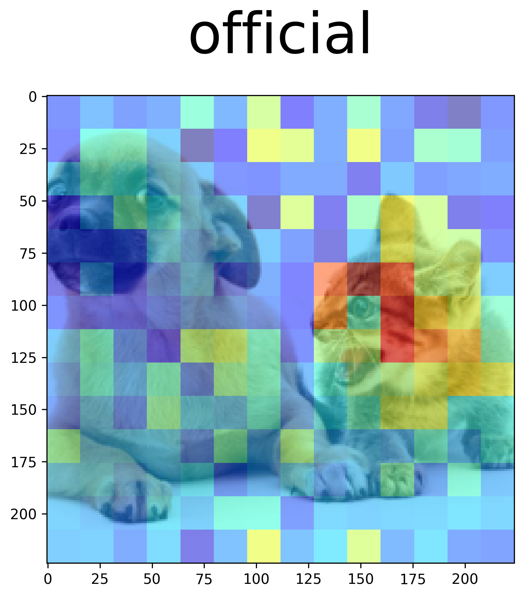
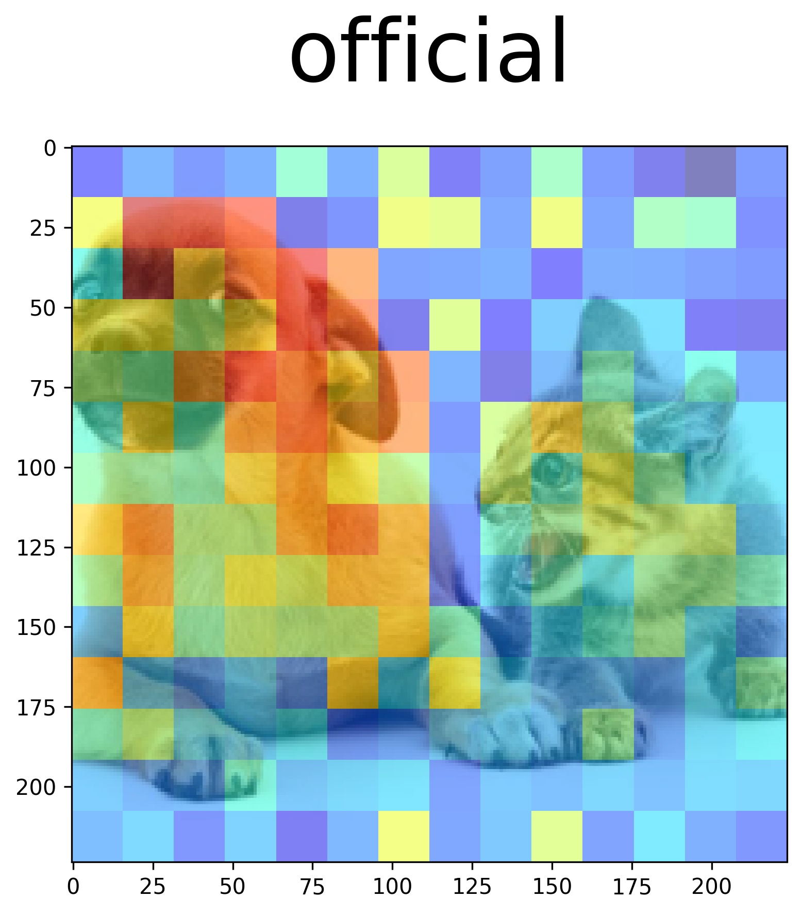
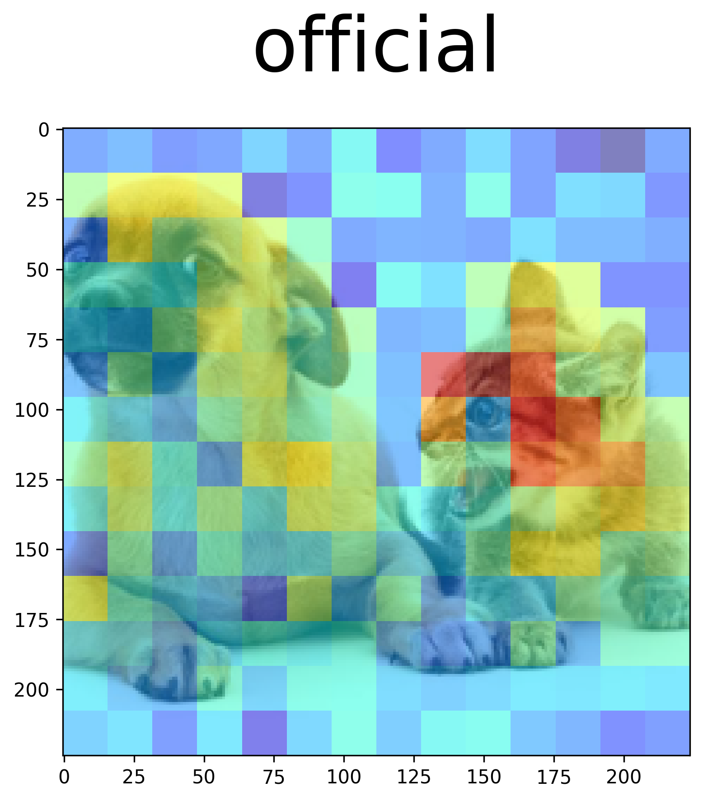

# Visualize CLIP heatmap

```python
# see example.py for reference
```

支持官方open_clip模型(`nn.MultiheadAttention`)、Naive MHA模型(`QKVSeparatedMultiheadAttention`)以及插入了LoRA的模型。

## EXAMPLES

```python
model_name = "ViT-B-16-quickgelu"
pretrained = "openai"
caption = "a photo of a cat"
```



---

```python
model_name = "ViT-B-16-quickgelu"
pretrained = "openai"
caption = "a photo of a dog"
```



---

```python
model_name = "ViT-B-16-quickgelu"
pretrained = "openai"
caption = "a photo of a dog and a cat"
```

